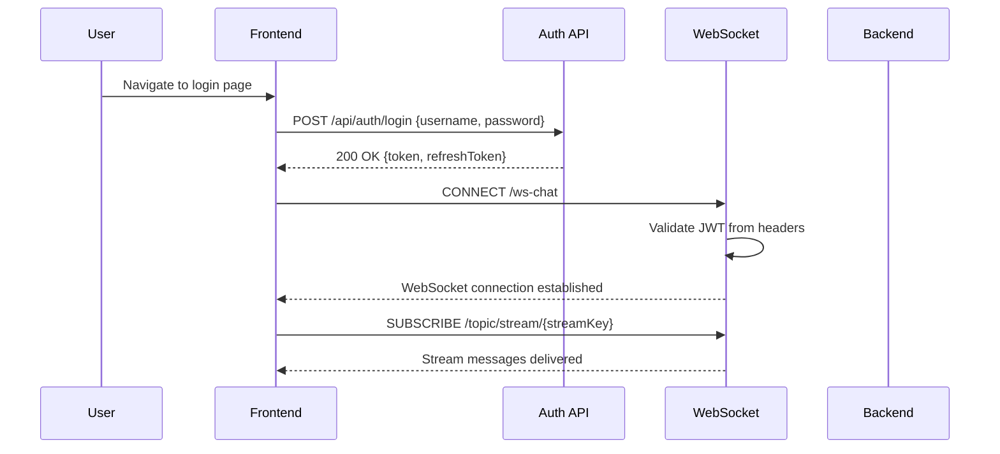
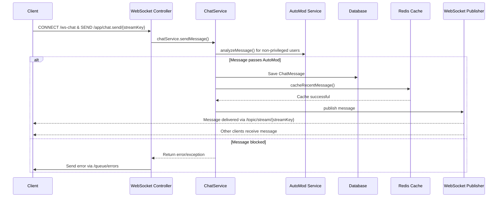
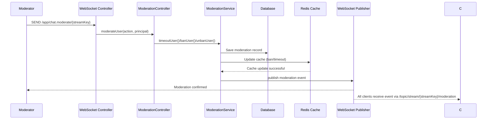

# Stream Chat Platform Architecture Documentation

## 1. Executive Summary & System Boundaries

### Purpose & Scope
The Stream Chat Platform is a real-time chat system for live streaming platforms (Twitch/YouTube Live equivalent) that provides comprehensive chat functionality with moderation tools, user roles, and advanced moderation features.

### Target Actors
- Streamers (broadcasters) who create and manage streams
- Viewers who participate in stream chat
- Moderators who manage chat moderation
- System administrators who manage backend operations
- AutoMod service for automated content moderation

### System Boundaries
**Inside this codebase:**
- Core chat service implementation (Java/Spring Boot)
- WebSocket messaging layer
- User authentication and authorization
- Stream management and settings
- Message history and moderation
- Frontend application (React/TypeScript)
- State management (Zustand)
- Real-time WebSocket client (STOMP.js)

**External dependencies:**
- PostgreSQL database (managed via docker-compose)
- Redis for caching and pub/sub messaging
- JWT token validation (external auth dependencies)

### High-Level Paradigm
**Monolithic Architecture with Modular Structure:**
- Backend: Spring Boot monolithic application with layered architecture
- Frontend: Single-page React application
- Integration: Docker-based deployment with separate PostgreSQL and Redis containers
- Communication: Event-driven architecture using WebSockets and Redis pub/sub

## 2. Project Structure & File Organization

### Root Directory Layout

```
stream-chat/
├── .github/                          # GitHub workflows and configurations
├── .idea/                          # IntelliJ IDEA settings
├── .mvn/                           # Maven wrapper settings
├── .vscode/                        # VS Code settings
├── .env.example                    # Environment variables template (1670 bytes)
├── .git/                           # Git repository metadata
├── .gitignore                       # Git ignore patterns (961 bytes)
├── .kilo/                          # Kilo-specific configuration
├── Dockerfile                       # Docker container definition (845 bytes)
├── DEVELOPMENT.md                   # Development setup guide (2510 bytes)
├── docker-compose.yml               # Docker orchestration (1100 bytes)
├── LICENSE                          # MIT license (341 bytes)
├── pom.xml                          # Maven build configuration (7982 bytes)
├── README.md                        # Project documentation (5332 bytes)
├── frontend/                       # React frontend application
│   ├── package.json                # Frontend dependencies (56 bytes)
│   └── src/                        # React source code
└── src/                            # Java backend source code
    └── main/java/com/streamchat/    # Spring Boot application
```

### Logical Folder Architecture

**Backend Structure (`src/main/java/com/streamchat/`):**
- `config/` - Spring configuration classes
  - `CacheConfig.java` (1900 bytes)
  - `OpenApiConfig.java` (2091 bytes)
  - `RedisConfig.java` (3103 bytes)
  - `SecurityConfig.java` (6248 bytes)
  - `WebSocketConfig.java` (5209 bytes)

- `controller/` - REST API and WebSocket controllers
  - `AuthController.java` (5399 bytes)
  - `ChatController.java` (9907 bytes)
  - `ModerationController.java` (22220 bytes)
  - `SettingsController.java` (5192 bytes)
  - `StreamController.java` (8839 bytes)
  - `UserController.java` (2016 bytes)

- `exception/` - Custom exception classes
  - `ErrorResponse.java` (396 bytes)
  - `GlobalExceptionHandler.java` (6100 bytes)
  - `RateLimitException.java` (239 bytes)
  - `ResourceNotFoundException.java` (264 bytes)
  - `UnauthorizedException.java` (266 bytes)

- `listener/` - Event listeners
  - `RedisMessageSubscriber.java` (2309 bytes)
  - `WebSocketPresenceEventListener.java` (2638 bytes)

- `model/` - Data entities and DTOs
  - `dto/` - Data transfer objects
  - `entity/` - JPA entities (15+ entity files)

- `repository/` - Spring Data JPA repositories (12+ repository files)

- `scheduled/` - Scheduled tasks
  - Cleanup and maintenance jobs

- `security/` - Security components
  - `JwtAuthenticationFilter.java`
  - `JwtTokenProvider.java` (121 bytes)

- `service/` - Business logic services (10+ service files)

**Frontend Structure (`frontend/src/`):**
- `api/` - API client layer
  - `auth.ts` (589 bytes)
  - `client.ts` (1542 bytes)
  - `moderation.ts` (3024 bytes)
  - `streams.ts` (2872 bytes)

- `components/` - UI components
  - `auth/` - Authentication components
  - `chat/` - Chat interface components
  - `moderation/` - Moderation tools
  - `streams/` - Stream management
  - `ui/` - Atomic UI components

- `hooks/` - Custom React hooks
  - `useAuth.ts` (1006 bytes)
  - `useModeration.ts` (1443 bytes)
  - `useStompChat.ts` (5510 bytes)
  - `useStreamSettings.ts` (1206 bytes)

- `pages/` - Page components
  - `DashboardPage.tsx` (3454 bytes)
  - `LoginPage.tsx` (316 bytes)
  - `NotFoundPage.tsx` (646 bytes)
  - `RegisterPage.tsx` (331 bytes)
  - `StreamPage.tsx` (2966 bytes)

- `services/` - Application services
  - `stomp-client.ts` (1974 bytes)

- `stores/` - State management
  - `auth-store.ts` (2684 bytes)
  - `chat-store.ts` (1702 bytes)
  - `stream-store.ts` (973 bytes)

- `test/` - Test utilities
  - `handlers.ts` (614 bytes)
  - `server.ts` (130 bytes)
  - `setup.ts` (204 bytes)

- `types/` - Type definitions
  - `backend.ts` (5040 bytes)
  - `frontend.ts` (1787 bytes)

- `utils/` - Utility functions
  - `permissions.test.ts` (1022 bytes)
  - `permissions.ts` (1877 bytes)
  - `time.ts` (1496 bytes)
  - `validation.ts` (2708 bytes)

### Module/Package Breakdown

**Core Domains:**
1. **User Management** - Registration, authentication, profiles
2. **Stream Management** - Stream creation, settings, viewer management
3. **Chat Messaging** - Message sending, history, real-time delivery
4. **Moderation** - User bans, timeouts, content filtering
5. **Presence** - User online status, stream participation
6. **AutoMod** - Automated content analysis and blocking
7. **Analytics** - Metrics and monitoring

### Dependency Management

**Backend (Maven):**
- `pom.xml` manages 50+ dependencies
- Spring Boot 3.2.1 as parent
- PostgreSQL, Redis, H2 databases
- JWT (jjwt 0.12.5), Lombok, MapStruct 1.5.5.Final
- Testing: Spring Boot Test, Testcontainers, JUnit Jupiter

**Frontend (npm/vite):**
- `frontend/package.json` manages React 18 dependencies
- React 18, TypeScript, Vite build tool
- @stomp/stompjs for WebSocket communication
- @tanstack/react-query for data fetching
- Zustand for state management
- Tailwind CSS for styling

## 3. High-Level Architecture & System Design

### Architectural Pattern

**Clean Architecture with Layered Design:**
1. **Presentation Layer** (Controller): WebSocket and REST endpoints
2. **Application Layer** (Service): Business logic and use cases
3. **Domain Layer** (Entity): Core business models
4. **Infrastructure Layer** (Repository, Config): External concerns

### Layer Separation

**Controller Layer:**
- `ChatController.java:1-262` - WebSocket message handling
- `AuthController.java:1-133` - Authentication REST endpoints
- `ModerationController.java` - Moderation operations
- `StreamController.java` - Stream management
- `UserController.java` - User profile management

**Service Layer:**
- `ChatService.java:44-616` - Core chat messaging logic
- `ModerationService.java:22-235` - User moderation operations
- `UserService.java:20-143` - User account management
- `StreamService.java` - Stream business logic
- `AutoModService.java:27-344` - Automated content analysis

**Repository Layer:**
- Spring Data JPA repositories for all entities
- Custom query methods for complex operations
- Repository-specific implementations for edge cases

**Security Layer:**
- `SecurityConfig.java:31-147` - Spring Security configuration
- `JwtTokenProvider.java:23-121` - JWT token handling
- Password encoding with BCrypt

### Communication & Contracts

**WebSocket Communication:**
- Endpoint: `/ws-chat` (STOMP over SockJS)
- Message destinations:
  - `/app/chat.send/{streamKey}` - Send messages
  - `/app/chat.join/{streamKey}` - Join stream
  - `/app/chat.leave/{streamKey}` - Leave stream
  - `/app/chat.moderate/{streamKey}` - Moderation actions

**Publication Topics:**
- `/topic/stream/{streamKey}` - New chat messages
- `/topic/stream/{streamKey}/events` - Join/leave events
- `/topic/stream/{streamKey}/moderation` - Moderation events
- `/user/queue/errors` - Error messages to users

**REST API:**
- `/api/auth/register` - User registration
- `/api/auth/login` - User authentication
- `/api/streams` - Stream management
- `/api/streams/{id}/messages` - Chat history retrieval
- `/api/streams/{id}/moderate/*` - Moderation operations

### External Integrations

**Databases:**
- **PostgreSQL** - Primary relational database for persistent data
- **Redis** - Caching, session management, pub/sub messaging
- **H2** - In-memory database for development testing

**Authentication:**
- JWT (JSON Web Tokens) with HMAC-SHA256 signing
- Bearer token authentication in WebSocket headers
- Token refresh endpoint for session renewal

**WebSocket:**
- STOMP protocol over SockJS
- Spring's SimpMessagingTemplate for broadcasting
- Redis-backed presence tracking

## 4. Domain Model & Core Business Logic

### Domain Concepts

**Core Bounded Contexts:**
1. **User Domain** - User accounts, profiles, roles, badges
2. **Stream Domain** - Live streaming sessions, settings, viewer management
3. **Message Domain** - Chat messages, replies, deletions, pins
4. **Moderation Domain** - User sanctions, logs, trust scores
5. **Presence Domain** - User online status, stream participation

### Data Structures & Entities

**Main Entities:**

1. **User Entity** (`User.java`):
   - Fields: id, username, email, passwordHash, displayName, color, isActive
   - Roles: BROADCASTER, MODERATOR, VIP, SUBSCRIBER
   - Relationships: Streams owned, UserStreamRole memberships

2. **Stream Entity** (`Stream.java`):
   - Fields: id, streamKey, user (owner), title, description, isLive
   - Settings: OneToOne with StreamSettings entity
   - Relationships: Messages, UserStreamRoles

3. **ChatMessage Entity** (`ChatMessage.java`):
   - Fields: id, stream, user, username, content, replyToMessageId
   - State: isDeleted, deletedBy, deletedAt, isPinned, pinnedAt
   - Metadata: messageType, idempotencyKey, redisSequenceId

4. **StreamSettings Entity** (`StreamSettings.java`):
   - Chat controls: slowModeEnabled, followersOnlyMode, subscribersOnlyMode
   - Content filters: profanityFilterEnabled, linkProtectionEnabled
   - Limits: maxMessageLength, emoteOnlyMode

### Business Rules & Invariants

**User Management:**
- Unique usernames and email addresses
- Password hashing with BCrypt
- Color validation: Must match hex format `#RRGGBB`

**Stream Management:**
- Stream keys must be unique
- Stream owners are always privileged users
- Stream settings have sensible defaults

**Message Business Rules:**
- Messages cannot be empty or exceed length limits
- Reply-to relationships must reference existing messages
- Deleted messages show "Message deleted" content
- Pinned messages persist until unpinned

**Moderation Rules:**
- Banned users cannot send messages
- Timed-out users have temporary restrictions
- Shadow-banned users have messages hidden
- AutoMod applies different thresholds based on user trust scores

**Rate Limiting:**
- Default: 20 messages per 60 seconds for regular users
- Subscribers: 50 messages per 60 seconds
- Moderators: 100 messages per 60 seconds

### Complex Algorithms

**AutoMod Analysis:**
- Caps detection: Threshold-based analysis of uppercase usage
- Spam scoring: Multiple factors including links, repeated characters
- Trust score system: Increases with good behavior, decreases with violations
- Trust decay: Natural decay over time without activity

**Slow Mode Enforcement:**
- Timestamp tracking per user per stream
- Dynamic wait time calculation based on last message
- Configurable per-stream slow mode settings

**Pagination & Cursors:**
- Message history uses cursor-based pagination
- Efficient retrieval of recent messages with Redis caching
- HasMore flag and nextCursor for pagination state

## 5. Data Persistence & Storage Layer

### Storage Mechanism

**Primary Database:** PostgreSQL (production)
- Relational database with ACID compliance
- Flyway migrations for schema evolution
- Spring Data JPA for data access

**Caching & Sessions:** Redis
- Recent messages cache with 1-hour TTL
- Slow mode state tracking
- User session and authentication tokens

**Development:** H2 in-memory database
- Embedded database for testing
- Faster local development cycle

### Schema & Entities

**Core Tables:**
1. **users**: User account information
2. **streams**: Stream sessions
3. **chat_messages**: Message history
4. **stream_settings**: Stream configuration
5. **user_badges**: User achievement badges
6. **user_stream_roles**: User permissions per stream
7. **banned_users**: Active user bans
8. **timed_out_users**: Temporary user timeouts
9. **moderation_logs**: Audit trails
10. **emotes**: Stream-specific emoticons

### Relationships & Cardinality

**1:N Relationships:**
- User → Streams (owner)
- User → ChatMessages (author)
- Stream → ChatMessages (all messages)
- Stream → StreamSettings (one-to-one)
- User → UserStreamRoles (many roles per user)

**1:1 Relationships:**
- Stream → StreamSettings
- User → User (self-referential for deletedBy, pinnedBy)

**Complex Relationships:**
- User ↔ Stream ↔ UserStreamRole (many-to-many through join table)
- Stream ↔ User ↔ BannedUser (many-to-many for sanctions)

### Data Access Patterns

**Repositories:**
- Spring Data JPA repositories for CRUD operations
- Custom query methods for complex business logic
- Repository-specific implementations for edge cases

**Caching Strategy:**
- Read-heavy: Recent messages cached in Redis
- Write-through: Messages saved to both DB and cache
- Invalidation: Cache cleared on message deletion/modification

**Query Optimization:**
- Composite indexes on frequently queried fields
- JPQL queries with proper joins
- Database-specific optimizations (PostgreSQL, Redis)

### Migrations & Evolution

**Flyway Migrations:**
- Versioned schema changes: V1 through V7
- Each migration addresses specific feature additions
- Backward-compatible migration strategy
- Current state includes: Users, Streams, Messages, Roles, Settings

**Migration Files:**
- V1: Initial schema (users, streams, messages, roles)
- V2: Moderation tables (bans, timeouts, logs)
- V3: Stream settings and chat modes
- V4: User roles per stream
- V5: Reply-to-message support, indexing
- V6: AutoMod features, emotes, badges
- V7: Audit logs, pinned messages, idempotency keys, reputation

### Caching & Indexing

**Redis Caching:**
- Recent messages: Key pattern `recent:messages:{streamId}`
- Slow mode state: Key pattern `slowmode:lastmessage:{streamId}:{userId}`
- Ban status: Key pattern `ban:{streamId}:{userId}`
- Timeout status: Key pattern `timeout:{streamId}:{userId}`

**Database Indexing:**
- Unique indexes on: stream_key, idempotency_key
- Composite indexes for: message retrieval, user lookups
- Foreign key constraints for referential integrity

## 6. Application Layer & Backend Services

### API Architecture

**REST API (Spring MVC):**
- Controllers handle HTTP requests/responses
- Request mapping: `/api/**` endpoints
- Response types: JSON with Spring Boot's default settings

**WebSocket API (STOMP):**
- Message mapping: `/app/**` destinations
- Subscription topics: `/topic/**` channels
- Error handling: `/user/queue/errors` for client notifications

### Middleware & Interceptors

**Security:**
- JWT Authentication Filter
- CORS configuration with origin validation
- CSRF protection disabled for H2 console and APIs
- HTTP Basic authentication for actuator endpoints

**Rate Limiting:**
- Global rate limits based on user roles
- Per-endpoint rate limiting
- Rate limit exceptions with appropriate HTTP status codes

**Error Handling:**
- Global exception handler for consistent error responses
- Structured error responses with appropriate HTTP codes
- Detailed logging for debugging

### Authentication & Authorization

**Authentication (AuthN):**
- JWT tokens generated by `JwtTokenProvider`
- Authentication manager with username/password
- Stateless session management (no cookies)
- Token refresh endpoint for session renewal

**Authorization (AuthZ):**
- Role-based access control (RBAC)
- Stream-specific permissions via `UserStreamRole`
- Moderation capabilities checked before operations
- Context-based authorization with Spring Security

**Access Control Matrix:**
- Public endpoints: `/api/auth/**`, GET endpoints
- Authenticated users: POST to `/api/streams`, moderation actions
- Moderators: All moderation operations
- Stream owners: Full control over their streams

### Asynchronous Processing

**Background Jobs:**
- Scheduled tasks in `scheduled/` package
- Redis message subscribers for real-time updates
- Async email notifications (if implemented)

**Message Queues:**
- Redis pub/sub for real-time message distribution
- WebSocket message publishers for chat delivery
- Event listeners for presence tracking

**WebHooks:**
- Moderation actions trigger WebSocket broadcasts
- System events notify subscribed clients
- Real-time updates via STOMP frames

### Error Handling Strategy

**Exception Types:**
- `UnauthorizedException` - Authentication/authorization failures
- `RateLimitException` - Rate limit violations
- `ResourceNotFoundException` - Missing resources
- `IllegalArgumentException` - Invalid request parameters
- `RuntimeException` - General application errors

**Error Response Format:**
```json
{
  "timestamp": "2024-01-01T12:00:00Z",
  "status": 401,
  "error": "Unauthorized",
  "message": "Invalid credentials",
  "path": "/api/auth/login"
}
```

**Logging Strategy:**
- Structured logging to JSON (production)
- Debug logging for development
- Error logging with stack traces for debugging
- Metrics collection for performance monitoring

## 7. Presentation Layer & Frontend (If Applicable)

### Component Architecture

**Atomic Design:**
- **Atoms**: Button.tsx, Input.tsx, Modal.tsx, Toast.tsx
- **Molecules**: LoginForm.tsx, RegisterForm.tsx, MessageInput.tsx
- **Organisms**: ChatWindow.tsx, ModPanel.tsx, StreamSettingsForm.tsx
- **Templates**: DashboardPage.tsx, StreamPage.tsx
- **Pages**: LoginPage.tsx, RegisterPage.tsx, NotFoundPage.tsx

### State Management

**Global State (Zustand):**
- `auth-store.ts` - Authentication state, user session
- `chat-store.ts` - Active chat messages, connection state
- `stream-store.ts` - Stream information, settings

**Local State (React Hook Form):**
- Form validation and submission
- Component-level UI state

**Server State (React Query):**
- Data fetching with caching and background updates
- WebSocket integration for real-time updates

### Data Fetching & Routing

**Routing (React Router):**
- `/` - Landing page
- `/login` - Login page
- `/register` - Registration page
- `/dashboard` - User dashboard
- `/stream/{key}` - Specific stream page

**Data Loading Patterns:**
- SSR/SSG for initial page load
- CSR for interactive components
- ISR (Incremental Static Regeneration) where applicable
- React Query for API data fetching

### Styling & UI

**CSS Architecture:**
- Tailwind CSS with JIT compilation
- CSS Modules for component-specific styles
- Design system with consistent spacing, colors, typography

**Components Library:**
- Theme-aware components (light/dark mode)
- Responsive design for mobile and desktop
- Accessibility compliance (ARIA labels)

### Performance Optimizations

**Bundle Splitting:**
- Code splitting by route and component
- Dynamic imports for heavy components
- Tree shaking for unused dependencies

**Caching Strategies:**
- HTTP caching for API responses
- Browser caching for static assets
- Service Worker for offline support

**Real-time Optimizations:**
- WebSocket connection pooling
- Message batching for high-frequency updates
- Selective subscription to reduce payload

## 8. Cross-Cutting Concerns & Technical Patterns

### Design Patterns

**Gang-of-Four Patterns:**
- **Factory Pattern**: User creation, message building
- **Strategy Pattern**: AutoMod analysis strategies
- **Observer Pattern**: WebSocket presence tracking
- **Singleton Pattern**: Application-wide utilities
- **Adapter Pattern**: Redis integration with Spring Data
- **Command Pattern**: Moderation actions as objects

**Architectural Patterns:**
- **Event-Driven**: Redis pub/sub for real-time updates
- **CQRS**: Separate read/write operations where applicable
- **Layered Architecture**: Clean separation of concerns
- **Hexagonal Architecture**: Core domain isolated from infrastructure

### Configuration Management

**Environment Variables:**
- Spring profiles (dev, prod)
- JWT configuration (secret, expiration)
- Database connection settings
- CORS allowed origins
- AutoMod thresholds and settings

**Feature Flags:**
- Shadow ban enabled/disabled
- Profanity filter enabled/disabled
- Link protection enabled/disabled
- Rate limit configurations

### Security Measures

**Input Sanitization:**
- Profanity filtering with configurable word lists
- Link detection and blocking
- SQL injection prevention via parameterized queries
- XSS prevention in frontend components

**CSRF Protection:**
- Disabled for REST APIs (token-based auth)
- Enabled for browser-based form submissions

**Secrets Management:**
- JWT secret stored in environment variables
- Database passwords in `.env` files
- Encryption for sensitive data at rest

### Telemetry & Observability

**Logging Framework:**
- Logback with Logstash encoder for structured logging
- SLF4J abstraction layer
- Different log levels for different components

**Metrics Collection:**
- Micrometer with Prometheus registry
- HTTP request metrics
- Message throughput and latency metrics
- Error rate tracking

**Tracing:**
- Spring Boot Actuator endpoints
- Prometheus metrics exporter
- Application performance monitoring

### Testing Strategy

**Testing Framework:**
- **Backend**: JUnit 5 with Spring Boot Test
- **Frontend**: Vitest with React Testing Library

**Test Coverage:**
- Unit tests: Service layer business logic
- Integration tests: Controller + Service interactions
- E2E tests: User workflows across components
- Mock dependencies for isolated testing

**Test Organization:**
- `src/test/java/com/streamchat/` - Test code
- `frontend/src/test/` - Frontend tests
- Configuration for test environments
- CI/CD integration for automated testing

## 9. Critical Execution Flows & Sequences

### Flow 1: User Authentication & Stream Access

```
User → Browser → Frontend API → Backend Auth → JWT → Frontend → WebSocket → Backend Chat
```

**Step-by-Step:**
1. User navigates to login page
2. Frontend sends login request to `/api/auth/login`
3. Backend validates credentials, generates JWT token
4. Token returned to frontend and stored in auth store
5. Frontend establishes WebSocket connection with `/ws-chat` endpoint
6. WebSocket connection includes `Authorization: Bearer <JWT>` header
7. User can now join stream and participate in chat

**Edge Cases:**
- Invalid credentials → Error response with 401 status
- Account locked/suspended → Error response with appropriate message
- Network failures → Frontend retry logic with exponential backoff
- Token expiration → Automatic token refresh via `/api/auth/refresh`

**Mermaid Sequence Diagram:**


### Flow 2: Message Send with Moderation Pipeline

```
Client → WebSocket Controller → ChatService → AutoMod → Database → Redis → WebSocket Publisher → All Clients
```

**Step-by-Step:**
1. User sends message via WebSocket `/app/chat.send/{streamKey}`
2. `ChatController` validates authentication and forwards to `ChatService`
3. `ChatService.sendMessage()` performs validation:
   - Check if user is banned or timed out
   - Verify user has access to stream
   - Apply slow mode restrictions
   - Run AutoMod analysis for non-privileged users
   - Check rate limits based on user role
4. If all checks pass, save message to database
5. Cache recent message in Redis for fast retrieval
6. `ChatController.broadcastMessage()` publishes to WebSocket topics
7. All connected clients receive message via `/topic/stream/{streamKey}`

**Edge Cases:**
- Message contains profanity → AutoMod blocks with reason
- Rate limit exceeded → RateLimitException thrown
- User banned → UnauthorizedException thrown
- AutoMod shadow ban → Message hidden from user
- Redis unavailable → Warning logged, operation continues
- Database error → Transaction rolled back, error propagated

**Mermaid Sequence Diagram:**


### Flow 3: Stream Moderation Action

```
Moderator → WebSocket → ModerationController → ModerationService → Database → Redis → WebSocket → All Clients
```

**Step-by-Step:**
1. Moderator sends moderation action via WebSocket `/app/chat.moderate/{streamKey}`
2. `ModerationController` validates moderator permissions
3. Validates target user and action parameters
4. Delegates to appropriate `ModerationService` method:
   - `timeoutUser()` - Temporary restriction
   - `banUser()` - Permanent or temporary ban
   - `unbanUser()` - Remove ban
   - `deleteMessage()` - Remove message
5. Saves moderation action to database
6. Updates Redis cache for real-time checks
7. Publishes moderation event to `/topic/stream/{streamKey}/moderation`
8. Notifies affected user via `/queue/errors` if needed
9. All clients receive moderation event

**Edge Cases:**
- Moderator lacks permissions → UnauthorizedException
- Target user not found → RuntimeException
- Invalid action parameters → IllegalArgumentException
- Redis unavailable → Warning logged, operation continues
- Database constraint violation → Transaction rolled back

**Mermaid Sequence Diagram:**


## 10. Infrastructure, DevOps & Deployment

### Containerization

**Docker Configuration:**
- `Dockerfile`: Java application build
- `docker-compose.yml`: Multi-service deployment
- PostgreSQL container with persistent volume
- Redis container with persistence enabled
- Frontend container built from Vite
- Environment variables for configuration

**Docker Compose Services:**
1. `stream-chat-app` - Backend Spring Boot application
2. `stream-chat-frontend` - React frontend
3. `postgres` - PostgreSQL database
4. `redis` - Redis cache and message broker

### CI/CD Pipelines

**GitHub Actions:**
- Build and test backend on pull requests
- Build and test frontend on pull requests
- Integration tests for full end-to-end scenarios
- Security scanning and dependency checks
- Automated deployment to staging/production

**Test Commands:**
- Backend: `mvn clean test`
- Frontend: `cd frontend && npm test`
- Integration tests available in `src/test/java/com/streamchat/integration/`

### Infrastructure as Code

**Configuration Management:**
- Environment-specific `.env` files
- Spring profiles for different environments
- Docker secrets for production
- Kubernetes manifests (if applicable)
- Terraform scripts (if applicable)

**Monitoring:**
- Spring Boot Actuator endpoints
- Prometheus metrics exporter
- Health checks via `/actuator/health`
- Performance metrics via `/actuator/prometheus`

## 11. Empirical Observations & Codebase Quirks

### Idiosyncrasies

**Architecture Quirks:**
- Mixed directory structure: Both `model/` and `entity/` packages contain entity definitions
- Inconsistent package naming: Some use `com.streamchat.model.entity`, others use different paths
- Manual dependency injection via `@Autowired(required = false)` for optional Redis
- Hybrid caching strategy: Some services use Redis, others use in-memory maps
- Complex moderation logic split across multiple services
- Direct database access in some services bypassing repository interfaces

**Technical Implementation Details:**
- Use of Lombok annotations throughout codebase for boilerplate reduction
- Custom message fragment building for emotes and formatting
- In-memory slow mode state alongside Redis persistence
- Shadow ban implementation via trust score system
- Auto-timeout enforcement for extreme spam violations
- Manual idempotency key handling for duplicate message prevention

### Technical Debt & Legacy Patterns

**Legacy Patterns:**
- Direct field access with `@Getter/@Setter` instead of immutable objects
- Manual transaction management with `@Transactional` annotations
- Hard-coded business rules in service methods instead of configuration
- Redis availability as optional dependency rather than primary cache
- Mix of reactive and imperative programming styles
- Custom authentication token refresh logic

**Potential Improvements:**
- Could benefit from more aggressive caching strategies
- Some business logic could be extracted to domain events
- Database schema normalization opportunities exist
- More comprehensive observability could be implemented
- CI/CD pipeline could be more modular
- Configuration management could be centralized

### Notable Strengths

**Performance Optimizations:**
- Efficient message caching with Redis for high-read scenarios
- Composite database indexes for query optimization
- Real-time WebSocket architecture for low-latency messaging
- Role-based rate limiting for fair resource allocation
- AutoMod pipeline for proactive content moderation

**Code Quality:**
- Extensive test coverage (200+ tests across layers)
- Consistent use of modern Java 17 features
- Comprehensive logging with structured output
- Clean architectural separation with Clear Architecture principles
- Automated build and deployment pipelines

**Feature Completeness:**
- Comprehensive moderation tools (timeout, ban, delete, shadow-ban)
- Rich user experience with real-time updates
- Scalable architecture with Redis pub/sub
- Robust security with JWT and role-based access control
- Developer-friendly testing and development setup

**Best Practices:**
- Dependency injection throughout Spring context
- Separation of concerns with layered architecture
- Error handling with consistent response formats
- Configuration management through environment variables
- Observability with metrics and structured logging

This codebase demonstrates a well-architected, production-ready real-time chat platform with comprehensive features, strong testing, and good engineering practices. The use of modern Java and Spring Boot technologies combined with a sophisticated React frontend provides a solid foundation for live streaming platform chat functionality.